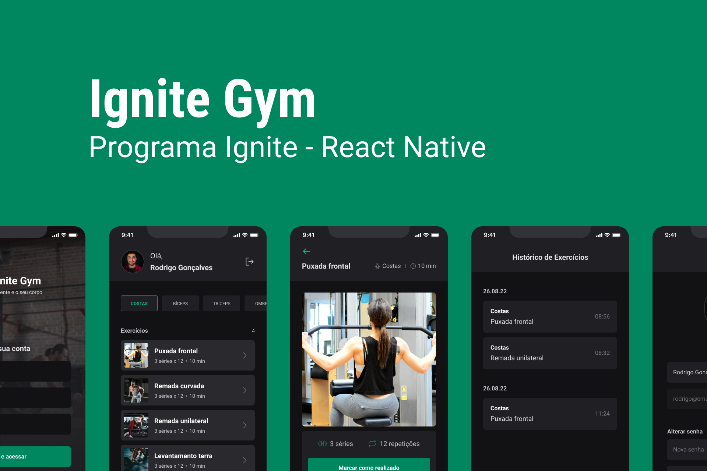

# Ignite GYM - Ignite | React Native

<a href="https://github.com/JosuePlacido/nlw-03/commits/master">
	
</a>

<span style="display: flex;">
 
</span>

<span style="display: flex">
 
</span>

## :page_with_curl: About <a id = "sobre"></a>

Application developed in the Rocketseat course (Ignite). We developed an application that has the responsibility to manager you exercise session in gym.

## Technologies <a id="tecs"></a>

### Requirements

- [Git](https://git-scm.com)
- [NodeJs](https://nodejs.org/en/)
- [Expo](https://expo.dev/)
- [Yarn](https://yarnpkg.com/) or [npm](https://www.npmjs.com/)

### Languages, frameworks and libs

- [React](https://reactjs.org/)
- [React Native](https://reactnative.dev/)
- [Typescript](https://www.typescriptlang.org/)
- [Native base](https://nativebase.io/): For CRUD in Storage
- [React Navigation](https://reactnavigation.org/): Navigate between screens:
- [react-native-svg](https://github.com/react-native-svg/react-native-svg): Support the usage of SVGs files
- [react-native-svg-transformer](https://github.com/kristerkari/react-native-svg-transformer): Permit import SVG as a JSX/TSX component.
- [react-hook-form](https://github.com/kristerkari/react-native-svg-transformer): Permit import SVG as a JSX/TSX component.
- [oneSignal](https://onesignal.com/): send and manage push notifications

### Concepts studed or applied

- Building interface with Component library
- SVG as component JSX
- validacao com yup
- controle de formulario com reac-hook-form
- update picture with file in gallery
- refresh token rotation strategy
- upload image to api
- notification push
- deep linking
- environment variable

### How to use 🚀

```bash
	# Configure the environment variable with .env file
	# EXPO_PUBLIC_ONE_SIGNAL_ID: id do app on OneSignal
	# EXPO_PUBLIC_API_ADDRESS: API address

	#start the api project
	cd api && yarn dev # or npm run dev

	#install dependencies
	yarn #npm run install

	#run app
	yarn android # npm run android

```

- SVG as component JSX
- validacao com yup
- controle de formulario com reac-hook-form
- update picture with file in gallery
- refresh token rotation strategy
- upload image to api
- notification push
- deep linking
- environment variable

## Autor

<a alt="Linkedin" href="https://linkedin/in/josueplacido">
 
 <br />
 <sub><b>Josué Placido</b></sub></a>

Developed ❤️ by Josué Placido! 👋🏽

[](https://www.linkedin.com/in/josueplacido/)
[](mailto:juplacido.jnr@gmail.com)
[](mailto:ozzyplacidojunior@hotmail.com)
